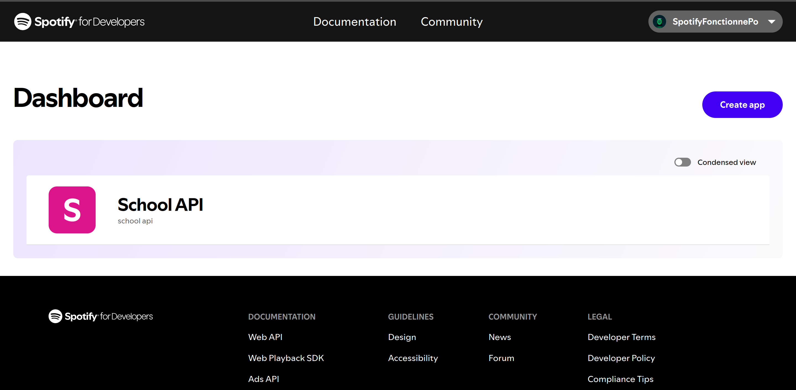
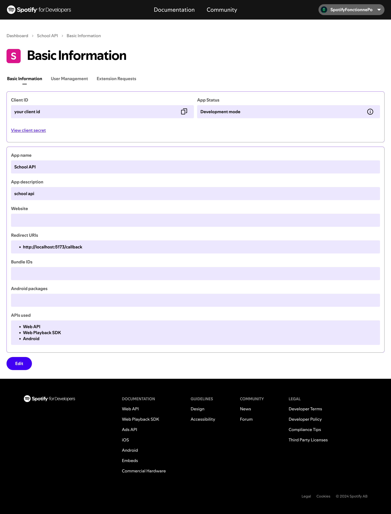
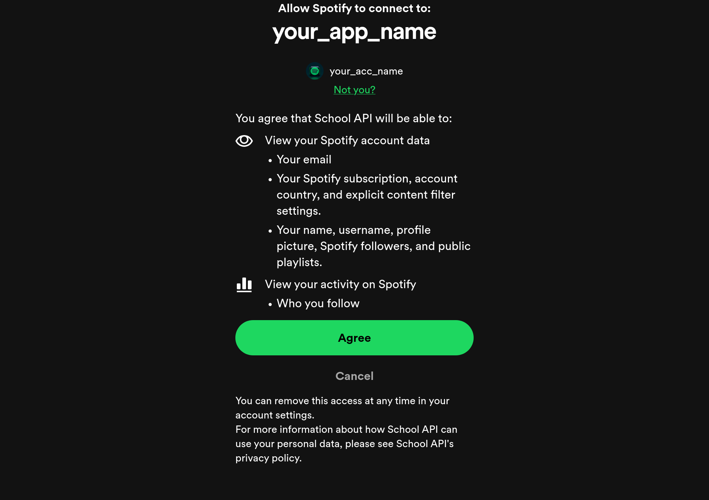

# Spotify Profile Demo

Ce projet est une démonstration de l'utilisation de l'API de Spotify pour récupérer et afficher les informations de profil d'un utilisateur.

## Prérequis

- PHP 7.4 ou supérieur
- Composer
- npm
- Un compte spotify


## Installation

1. Clonez le dépôt :
    ```bash
    git clone https://github.com/fabien-design/spotify-profile-API.git
    cd spotify-profile-API
    ```

2. Installez les dépendances avec Composer :
    ```bash
    composer install
    ```
3. Installer les dépendances node:
    ```bash
    npm install
    ```
4. Créez un fichier `.env.local` à la racine du projet et ajoutez vos informations d'identification Spotify :
    ```
    VITE_CLIENT_ID=your_client_id
    VITE_REDIRECT_URI=your_redirect_uri
    ```

## Obtention du Client ID et du Redirect URI

1. Connectez-vous à votre compte Spotify et accédez au [Tableau de bord des développeurs Spotify](https://developer.spotify.com/dashboard).

2. Cliquez sur "Create App" et remplissez les informations requises.


3. Une fois l'application créée, vous verrez votre `Client ID` et `Client Secret`. Copiez-les dans votre fichier `.env`.

4. Ajoutez l'URL de redirection (Redirect URI) dans les paramètres de votre application Spotify. Utilisez `http://localhost:5173/callback` (port 5173, utilisé par défaut par Vite) comme URI de redirection.



## Utilisation

1. Démarrez le serveur (utilisation de vite) :
    ```bash
    npm run dev
    ```

2. Ouvrez votre navigateur et accédez à `http://localhost:5173`.

3. Autorisez l'application à accéder à vos informations de profil.



4. Une fois connecté, votre profil Spotify sera affiché.

## Licence

Ce projet est sous licence MIT. Voir le fichier [LICENSE](LICENSE) pour plus de détails.
